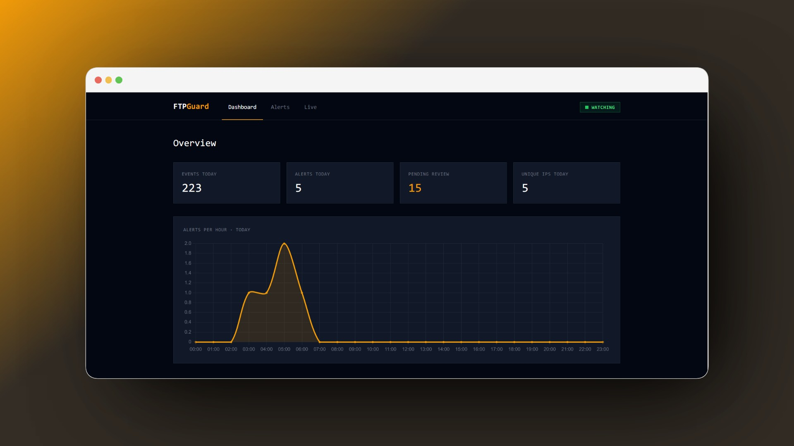

# FTPGuard



A host-based intrusion detection system for FTP servers. It combines an Isolation Forest ML model with a 5-rule signature engine and a human-in-the-loop (HITL) feedback loop.

## How it works

1. The parser reads vsftpd log lines and extracts structured events.
2. The session builder groups events by client IP into sessions.
3. The feature extractor computes 17 numeric features per session.
4. The detector (Isolation Forest) scores each session from 0.0 (normal) to 1.0 (anomalous).
5. The rule engine checks for known attack signatures.
6. If either the ML score exceeds the threshold or a rule fires, the session is flagged as an alert.
7. The administrator can mark false positives as normal via the dashboard, and retrain the model.

## Rule engine (5 rules)

Supported rules: 

- VSFTPD_234_BACKDOOR: detects CVE-2011-2523 exploit attempts (USER with `:)` suffix).
- FTP_BOUNCE_MGLNDD: detects MGLNDD scanner probes.
- PORT_SCAN: detects connections with no FTP commands (banner grab).
- BRUTE_FORCE: detects sessions with 5 or more failed login attempts.
- ANONYMOUS_ABUSE: detects anonymous login attempts with write commands.

## Project structure

```
src/ftp_ids/
    cli.py                  # CLI entry point (ftp-ids command)
    config.py               # paths, contamination, defaults
    core/
        detector.py         # Isolation Forest training and scoring
        feature_extractor.py # 17 features from session dicts
        rule_engine.py      # 5-rule signature engine
        session_builder.py  # groups events into sessions by IP
        storage.py          # alerts.csv and clean_pool.csv I/O
    parsers/
        base.py             # abstract parser
        vsftpd_parser.py    # vsftpd log line parser
    dashboard/
        app.py              # Flask app
        stats.py            # dashboard statistics
        alerts_service.py   # alert listing, detail, labeling
        retrain_service.py  # retrain via subprocess
        templates/          # Jinja2 templates (6 pages)
data/
    samples/                # sample log files
    models/                 # trained model (.pkl)
    reports/                # alerts.csv, clean_pool.csv
notebooks/
    eda.ipynb               # exploratory data analysis
    evaluation.ipynb        # model evaluation
scripts/
    anonymize.py            # log anonymization
tests/
    test_vsftpd_parser.py   # parser unit tests
```

## Requirements

- Python 3.10+
- vsftpd with `log_ftp_protocol=YES` in `/etc/vsftpd.conf`

## Setup

Tested on Ubuntu 24.04 with vsftpd 3.0.3.

```bash
# clone the repo
git clone https://github.com/AmraniCh/ftp-ids-ml.git
cd ftp-ids-ml

# create virtual environment
python3 -m venv venv
source venv/bin/activate

# install dependencies
pip install -r requirements.txt

# install the package (editable mode)
pip install -e .
```

## vsftpd configuration

Add these lines to `/etc/vsftpd.conf` to enable detailed logging:

```
log_ftp_protocol=YES
xferlog_enable=YES
```

Then restart vsftpd:

```bash
sudo systemctl restart vsftpd
```

## CLI usage

```bash
# parse a log file and print events
ftp-ids parse --log /var/log/vsftpd.log

# show sessions
ftp-ids sessions --log /var/log/vsftpd.log

# extract features
ftp-ids extract --log /var/log/vsftpd.log

# train the model
ftp-ids train --log /var/log/vsftpd.log

# watch for new sessions in real time
ftp-ids watch --log /var/log/vsftpd.log

# mark a session as normal (HITL feedback)
ftp-ids correct --ip 192.168.1.10 --start "2026-06-21 03:41:05"

# retrain the model with feedback
ftp-ids retrain --log /var/log/vsftpd.log
```

## Dashboard

```bash
cd src/ftp_ids/dashboard
flask run
```

Open `http://localhost:5000` in the browser.

Pages: overview with stats, alerts list with pagination, alert detail with 17 features, live monitoring with real-time notifications.

## Anonymization

Before sharing log files, run the anonymization script:

```bash
# copy the example config
cp scripts/anonymize.example.conf scripts/anonymize.conf

# edit anonymize.conf with your real values
# (this file is gitignored)

# run
python scripts/anonymize.py data/raw/vsftpd.log data/raw/vsftpd_anon.log scripts/anonymize.conf
```

## License

MIT 